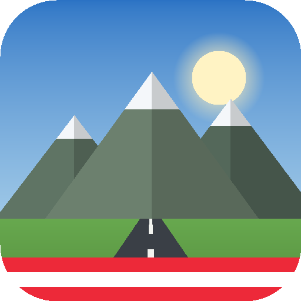

# Grand Theft Alpen 2.0 — Oberösterreich Edition

Ein Open-World-Spiel im Alpenraum, das **nativ unter Linux (Ubuntu)** läuft.
Kein Handy, kein Touchscreen — Tastatur und Maus.



---

## Schnellstart unter Ubuntu

```bash
cd gta-alpen
./run.sh
```

Beim ersten Start lädt `run.sh` einmalig Electron herunter (ca. 100 MB) und startet
danach ein echtes Programmfenster.

Falls `node` fehlt:

```bash
sudo apt update && sudo apt install -y nodejs npm
```

### Ins Anwendungsmenü eintragen

```bash
./install-desktop.sh
```

Danach steht „Grand Theft Alpen" in der Aktivitäten-Suche und lässt sich wie jedes
andere Programm starten. Entfernen mit `./install-desktop.sh --remove`.

### Ohne Electron spielen

```bash
./run.sh --browser
```

Startet einen kleinen lokalen Server und öffnet das Spiel im installierten Browser
(Chromium im App-Modus oder Firefox). Nützlich, wenn Electron nicht gewünscht ist.

### Bei Grafikproblemen

In virtuellen Maschinen oder bei alten Treibern hilft Software-Rendering:

```bash
./run.sh --software
```

---

## Installationspaket bauen (.deb / AppImage)

```bash
npm install
npm run dist
```

Die fertigen Pakete liegen danach unter `dist/`:

```bash
sudo dpkg -i dist/grand-theft-alpen_2.0.0_amd64.deb
# oder
chmod +x dist/Grand*.AppImage && ./dist/Grand*.AppImage
```

---

## Steuerung

| Taste | Wirkung |
|---|---|
| `W A S D` | Laufen bzw. Lenken und Gas/Bremse |
| `Maus` | Umsehen (Kamera) |
| `Shift` | Sprinten |
| `Leertaste` / `Linksklick` | Angriff, Schuss |
| `Rechtsklick` | Zielen |
| `E` | **Einsteigen · Aussteigen · Haus betreten · Mit Leuten reden** |
| `F` | Gegenstand aufheben |
| `R` | Nachladen |
| `1`–`9`, `Q`, Mausrad | Waffe wechseln |
| `G` | Garage, Waffenladen, Charakter |
| `M` / `Tab` | Karte |
| `` ` `` | Grafikstufe umschalten |
| `F11` | Vollbild |
| `Esc` | Pause |

Die `E`-Taste zeigt unten immer an, was gerade möglich ist — zum Beispiel
„**E** RS Coupé einsteigen" oder „**E** Wirtshaus betreten".

---

## Was drin ist

**Welt**
Dorf mit begehbaren Häusern, Kirche, Tankstelle, Badesee mit Steg und Booten,
Ringstraße mit Verkehr, Feldwege, Windräder, Berge ringsum.

**Häuser mit Innenleben**
Jedes Haus lässt sich betreten und ist anders eingerichtet — Wohnzimmer, Küche,
Schlafzimmer, Werkstatt, Büro, Bauernstube, Kinderzimmer, Laden, Wirtshaus,
Atelier, Jagdhütte, Waschküche, Musikzimmer, Bibliothek, Garage, Gewächshaus,
Fitnessraum und Dachboden. Das Dach wird beim Betreten ausgeblendet.

**Fahrzeuge**
Über zwanzig Fahrzeuge vom Kleinwagen bis zum Hypercar, dazu mehrere
Motorräder, Roller und Quads. Alle kaufbar in der Garage.

**Waffen und Gegenstände**
Nahkampf und Schusswaffen mit Munitionsverwaltung. In der Welt und in den Häusern
liegen Gegenstände zum Aufheben: Geld, Erste-Hilfe-Kästen, Schutzwesten,
Munition, Werkzeug und Sammelstücke.

**Leute**
Passanten mit unterschiedlichem Aussehen und Verhalten — Bauern, Jogger,
Touristen, Jäger, Wirtinnen und mehr. Sie unterhalten sich, sehen sich um,
weichen Autos aus und fliehen, wenn es brenzlig wird. Ansprechbar mit `E`.
Die Polizei reagiert auf Fahndungssterne.

**Missionen**
Mehrteilige Aufträge mit Geschichte: Fahrten, Rennen, Einbrüche, Suchaufträge
und Auseinandersetzungen. Wiederholung bringt die halbe Belohnung.

**Charakter**
Hautton, Kleidung, Haare, Kopfbedeckung, Körperbau, Jacke, Bart und Brille
lassen sich in der Garage einstellen.

---

## Spielstand

Im nativen Build liegt der Spielstand unter
`~/.config/Grand Theft Alpen/savegame.json`.
Im Browser-Modus im lokalen Speicher des Browsers.
Löschen über das Menü *Spiel → Spielstand löschen* oder im Pausemenü.

---

## Projektaufbau

```
gta-alpen/
├── electron/         Hauptprozess und Brücke zum Spielstand
├── src/
│   ├── index.html    Gerüst und Skriptreihenfolge
│   ├── style.css     Oberfläche
│   ├── vendor/       three.js r128 (lokal, kein Netz nötig)
│   └── js/
│       ├── config.js      Weltmaße, Paletten, Grafikstufen
│       ├── util.js        Primitive, Mathe, Kollision
│       ├── textures.js    prozedurale Texturen
│       ├── characters.js  Figurenmodell und Animation
│       ├── vehicles.js    Fahrzeugkatalog
│       ├── interiors.js   Möbel und Einrichtungen
│       ├── buildings.js   Häuser mit begehbarem Inneren
│       ├── world.js       Gelände, Straßen, Vegetation
│       ├── traffic.js     Verkehr und Polizeifahrzeuge
│       ├── items.js       Gegenstände zum Aufheben
│       ├── weapons.js     Waffen und Kampf
│       ├── npcs.js        Passanten, Polizei, Gegner
│       ├── audio.js       prozeduraler Klang
│       ├── player.js      Zustand, Physik, Kamera
│       ├── missions.js    Aufträge
│       ├── ui.js          HUD, Garage, Karte
│       ├── input.js       Tastatur und Maus
│       └── main.js        Aufbau und Hauptschleife
└── tools/            Symbol erzeugen, Server, Syntaxprüfung
```

Es gibt keinen Übersetzungsschritt: alle Dateien sind klassische Skripte und
werden direkt geladen. Nach einer Änderung genügt `F5` im Spielfenster.

Syntaxprüfung aller Module:

```bash
npm run lint
```

---

## Lizenz

Der Spielcode steht unter MIT. three.js liegt unter `src/vendor/` mit eigener
MIT-Lizenz bei.

Der Name lehnt sich als Wortspiel an ein bekanntes Vorbild an. Für eine
kommerzielle Veröffentlichung sollten Name und Logo eigenständig gewählt werden.
